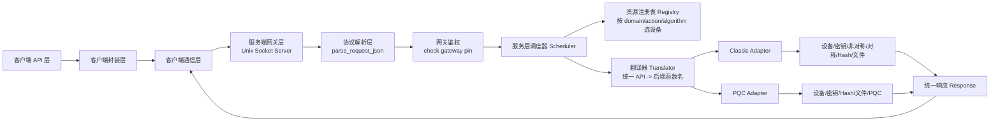

# 统一密码机网关总体架构（中文）

## 1. 目标

本工程只考虑**本机加载密码机驱动库**的场景，不考虑 HTTP 远程设备，也不把用户 PIN 透传为底层密码机 PIN。

当前设计目标：

1. 对外暴露统一 API。
2. 网关只校验自己的 `gateway pin`。
3. 传统/现代密码机与抗量子密码机通过不同 adapter 接入。
4. adapter 接口保留 7 大类 handler；CCM 兼容层只做上层路由覆盖，不代表所有底层 SAF 语义已真实实现：
   - 设备管理类函数
   - 环境类函数
   - 密码运算类函数：Hash、MAC、对称加解密、非对称加解密
   - 密钥管理类函数：密钥生成、导入导出、销毁查询、KEM、密钥协商、混合密钥协商
   - 数字签名类函数：签名、验签、摘要签名、混合签名
   - 杂凑运算函数
   - 用户文件操作函数
   - 抗量子算法运算函数
5. 新设备接入时，优先只改两处：
   - `configs/devices.conf`
   - 新增一个 `src/server/driver/driver_vendor_x.c`
6. 源码层次清晰区分客户端层、服务端层和公共代码层。

---

## 2. 统一 API

统一请求字段：

- `domain`：功能域
- `action`：动作
- `algorithm`：算法或变种
- `key_ref`：业务侧密钥引用
- `payload`：主输入
- `aux_payload`：辅助输入
- `user_pin`：网关 PIN
- `device_hint`：可选设备提示
- `sequence`：可选串行编排

### 2.1 domain

- `auth`
- `device`
- `key`
- `asym`
- `sym`
- `hash`
- `file`
- `pqc`

### 2.2 action

- `check_pin`
- `get_device_info`
- `generate_random`
- `get_private_key_access`
- `release_private_key_access`
- `generate_key_pair`
- `export_public_key`
- `import_key`
- `destroy_key`
- `sign`
- `verify`
- `encrypt`
- `decrypt`
- `mac`
- `hash`
- `create_file`
- `read_file`
- `write_file`
- `delete_file`
- `kem_encap`
- `kem_decap`

> 关键点：操作和算法分离。比如 `dilithium3` 属于 `pqc + sign/verify`；`mlkem768` 属于 `pqc + kem_encap/kem_decap`。

---

## 3. 源码分层

```text
src/
├── client/
│   ├── api/          # 客户端接口层：CLI/API 入口
│   ├── core/         # 客户端封装层：请求读取、调用通信层、输出响应
│   └── transport/    # 客户端通信层：Unix Domain Socket 收发
├── common/           # 公共代码：日志等通用能力
└── server/
    ├── gateway/      # 服务端网关层：main/server/protocol/queue
    ├── service/      # 服务端服务层：config/resource/scheduler/translator
    └── driver/       # 服务端驱动层：driver_dispatch/driver_classic/driver_pqc/skf_adapter
```

### 3.1 客户端层

- `src/client/api/client_api.c`：客户端入口，对外承接命令行调用。
- `src/client/core/client_core.c`：客户端封装层，组织请求读取、通信调用和响应输出。
- `src/client/transport/client_transport.c`：客户端通信层，只处理 Unix Socket 连接、写入和读取。

### 3.2 服务端层

- `src/server/gateway/`：请求入口、socket server、协议解析和队列。
- `src/server/service/`：配置加载、资源注册、调度和统一 API 到后端调用的翻译。
- `src/server/driver/`：隔离具体密码机、PQC 或 SKF 适配差异。

### 3.3 公共层

- `src/common/log.c`：客户端和服务端共享日志实现。

---

## 4. 架构图



---

## 5. 关键分层

### 5.1 客户端 API 层

负责提供客户端入口和对外调用边界，当前文件为 `src/client/api/client_api.c`。

### 5.2 客户端封装层

负责把输入、通信调用、输出封装成稳定流程，当前文件为 `src/client/core/client_core.c`。

### 5.3 客户端通信层

负责 Unix Domain Socket 通信，当前文件为 `src/client/transport/client_transport.c`。

### 5.4 服务端网关层

负责 socket 入口、请求读取、协议解析、队列等网关入口职责。对应目录：`src/server/gateway/`。

### 5.5 网关鉴权层

只验证 `configs/gateway.conf` 中的 `gateway_pin`。

- 这是网关自己的 PIN
- 不是底层密码机 PIN
- 不做透传模式

### 5.6 服务调度层

根据：

- `domain`
- `action`
- `algorithm`
- `device_hint`
- `preference`

从 `devices.conf` 中挑选可用设备。对应目录：`src/server/service/`。

### 5.7 翻译层

负责把统一 API 转换成后端调用描述，例如：

- `asym + sign + sm2` -> `SDF_InternalSign_ECC_Ex`
- `pqc + kem_encap + mlkem768` -> `SDF_Encap_Kyber`
- `hash + hash + sm3` -> `SDF_HashInit/SDF_HashUpdate/SDF_HashFinal`

### 5.8 Driver / Adapter 层

Adapter 是真正隔离厂商差异的地方。

- `src/server/driver/driver_classic.c`
- `src/server/driver/driver_pqc.c`
- `src/server/driver/skf_adapter.c`

它们对外都实现统一的 handler 或驱动适配能力。

---

## 6. 新设备如何接入

### 6.1 简单接入

如果只是新增一台能力类似的设备：

1. 在 `devices.conf` 中新增一行
2. 填写 `backend_profile`
3. 声明支持的 `domain:action:algorithm`

### 6.2 新后端接入

如果是新的本地密码机驱动库，且函数参数格式不兼容：

1. 在 `src/server/driver/` 新增一个 adapter 文件，如 `driver_vendor_x.c`
2. 实现 7 大类 handler
3. 在 `src/server/service/translator.c` 中补充映射表
4. 在 config 中声明 `backend_profile`

这就是当前场景下最接近“一键接入”的方式：

- 配置注册
- adapter 落地

---

## 7. 示例

### 7.1 网关 PIN 校验

```json
{"request_id":"auth-1","domain":"auth","action":"check_pin","user_pin":"123456"}
```

### 7.2 传统密码机签名

```json
{"request_id":"r1","domain":"asym","action":"sign","algorithm":"sm2","key_ref":"k1","payload":"hello","user_pin":"123456"}
```

### 7.3 抗量子 KEM 封装

```json
{"request_id":"r2","domain":"pqc","action":"kem_encap","algorithm":"mlkem768","key_ref":"k2","payload":"peer_pub","user_pin":"123456"}
```

### 7.4 串行混合流程

```json
{"request_id":"r3","domain":"asym","action":"sign","algorithm":"sm2","key_ref":"k1","payload":"hello","user_pin":"123456","sequence":"asym:sign:classic:sm2>pqc:sign:pqc:dilithium3"}
```

---

## 8. 当前版本边界

当前版本是**统一 API + adapter 骨架 + mock 结果验证**，适合：

- 验证接口抽象是否合理
- 验证新设备接入方式
- 验证调度与映射表设计
- 验证客户端/服务端分层是否清晰

当前版本还没有展开：

- 真实 `dlopen/dlsym`
- 真实 `OpenDevice/OpenSession`
- 真实底层密码机调用

这些将在下一阶段替换到 `src/server/driver/` 内部。

## CCM 上层统一接口

在现有网关统一 API 之上新增 `CCM_` 前缀上层接口，位置为：

- `include/ccm.h`：公开算法 ID、`Unif_AlgParams`、`Unif_KeyRef`、`Unif_Buffer` 和四类统一函数声明。四类为环境类、密码运算类、密钥管理类、数字签名类；不包含证书、消息、USBKey 或厂商设备专用上层接口。
- `src/client/api/ccm_api.c`：把完整 C API 参数归一化为既有 JSON 请求

接口设计遵循：对称与非对称分离、能用 `uiAlgID` 表达的算法差异一律不拆函数名、Dilithium/Kyber/ML-KEM/Hybrid 通过算法 ID 与扩展参数接入、保留 `void *pExParams` 适配特殊算法参数。

这层不是换皮函数名；它是上层完整参数面到既有 JSON API 的适配层。底层真实密码语义仍由现有 JSON API、scheduler、translator、adapter 和设备 SDK 保证。

## 托管式统一密码服务边界

UCiSDK 定位为托管式统一密码服务平台。上层应用只能通过 `CCM_*` 函数接口提交算法、动作、数据和统一密钥引用；网关 PIN 只用于网关认证，不能当作底层密码机、密码钥匙或软件库 PIN 透传。内部密钥引用必须携带 `device_id` 或由托管 `key_id` 解析到具体设备，不能把裸 `key_index` 当作全局密钥标识。软件库等后端只声明自己支持的 key source 能力，例如外部密钥能力，不支持内部索引密钥时由调度层过滤，adapter 层仅作为最终兜底。
