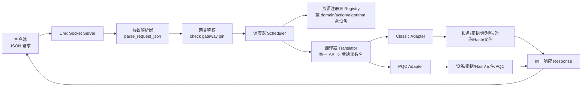

# 统一密码机网关总体架构（中文）

## 1. 目标

本工程只考虑**本机加载密码机驱动库**的场景，不考虑 HTTP 远程设备，也不把用户 PIN 透传为底层密码机 PIN。

当前设计目标：

1. 对外暴露统一 API。
2. 网关只校验自己的 `gateway pin`。
3. 传统/现代密码机与抗量子密码机通过不同 adapter 接入。
4. adapter 接口完整覆盖 7 大类函数族：
   - 设备管理类函数
   - 密钥管理类函数
   - 非对称密码运算函数
   - 对称密码运算函数
   - 杂凑运算函数
   - 用户文件操作函数
   - 抗量子算法运算函数
5. 新设备接入时，优先只改两处：
   - `configs/devices.conf`
   - 新增一个 `backend_xxx_adapter.c`

---

## 2. 统一 API

统一请求字段：

- `domain`：功能域
- `action`：动作
- `algorithm`：算法或变种
- `key_ref`：业务侧密钥引用
- `payload`：主输入
- `aux_payload`：辅助输入
- `user_pin`：网关 PIN
- `device_hint`：可选设备提示
- `sequence`：可选串行编排

### 2.1 domain

- `auth`
- `device`
- `key`
- `asym`
- `sym`
- `hash`
- `file`
- `pqc`

### 2.2 action

- `check_pin`
- `get_device_info`
- `generate_random`
- `get_private_key_access`
- `release_private_key_access`
- `generate_key_pair`
- `export_public_key`
- `import_key`
- `destroy_key`
- `sign`
- `verify`
- `encrypt`
- `decrypt`
- `mac`
- `hash`
- `create_file`
- `read_file`
- `write_file`
- `delete_file`
- `kem_encap`
- `kem_decap`

> 关键点：操作和算法分离。比如 `dilithium3` 属于 `pqc + sign/verify`；`mlkem768` 属于 `pqc + kem_encap/kem_decap`。

---

## 3. 架构图



---

## 4. 关键分层

### 4.1 协议层

负责把客户端请求解析成统一结构 `request_t`。

### 4.2 网关鉴权层

只验证 `configs/gateway.conf` 中的 `gateway_pin`。

- 这是网关自己的 PIN
- 不是底层密码机 PIN
- 不做透传模式

### 4.3 调度层

根据：

- `domain`
- `action`
- `algorithm`
- `device_hint`
- `preference`

从 `devices.conf` 中挑选可用设备。

### 4.4 翻译层

负责把统一 API 转换成后端调用描述，例如：

- `asym + sign + sm2` -> `SDF_InternalSign_ECC_Ex`
- `pqc + kem_encap + mlkem768` -> `SDF_Encap_Kyber`
- `hash + hash + sm3` -> `SDF_HashInit/SDF_HashUpdate/SDF_HashFinal`

### 4.5 Adapter 层

Adapter 是真正隔离厂商差异的地方。

- `driver_classic.c`
- `driver_pqc.c`

它们对外都实现统一的 7 大类 handler。

---

## 5. 新设备如何接入

### 5.1 简单接入

如果只是新增一台能力类似的设备：

1. 在 `devices.conf` 中新增一行
2. 填写 `backend_profile`
3. 声明支持的 `domain:action:algorithm`

### 5.2 新后端接入

如果是新的本地密码机驱动库，且函数参数格式不兼容：

1. 新增一个 adapter 文件，如 `driver_vendor_x.c`
2. 实现 7 大类 handler
3. 在 translator 中补充映射表
4. 在 config 中声明 `backend_profile`

这就是当前场景下最接近“一键接入”的方式：

- 配置注册
- adapter 落地

---

## 6. 示例

### 6.1 网关 PIN 校验

```json
{"request_id":"auth-1","domain":"auth","action":"check_pin","user_pin":"123456"}
```

### 6.2 传统密码机签名

```json
{"request_id":"r1","domain":"asym","action":"sign","algorithm":"sm2","key_ref":"k1","payload":"hello","user_pin":"123456"}
```

### 6.3 抗量子 KEM 封装

```json
{"request_id":"r2","domain":"pqc","action":"kem_encap","algorithm":"mlkem768","key_ref":"k2","payload":"peer_pub","user_pin":"123456"}
```

### 6.4 串行混合流程

```json
{"request_id":"r3","domain":"asym","action":"sign","algorithm":"sm2","key_ref":"k1","payload":"hello","user_pin":"123456","sequence":"asym:sign:classic:sm2>pqc:sign:pqc:dilithium3"}
```

---

## 7. 当前版本边界

当前版本是**统一 API + adapter 骨架 + mock 结果验证**，适合：

- 验证接口抽象是否合理
- 验证新设备接入方式
- 验证调度与映射表设计

当前版本还没有展开：

- 真实 `dlopen/dlsym`
- 真实 `OpenDevice/OpenSession`
- 真实底层密码机调用

这些将在下一阶段替换到 adapter 内部。
